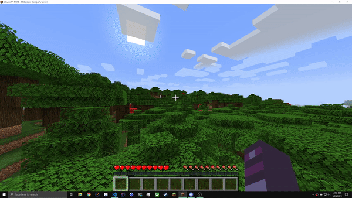

# MC Discord

## About

MC Discord is a Minecraft server plugin that adds in-game commands to perform actions on your Discord server. It is compatible with Spigot and Paper servers.

## Features

### Coordinates

MC Discord can post coordinates to a specified text channel using in game commands. These coordinates can be viewed either in Discord or in-game.

Demo

## Commands

- /save-coord _name [x y z]_
  - Saves a coordinate with the given one-word name. Can either manually supply values or player's location will be used.
- /delete-coord _name_
  - Deletes the coordinate with the given name. Will fail if trying to delete a coordinate added by another player.
- /get-coord _name_
  - Displays the coordinate with the given name.
- /list-coords
  - Displays all coordinates saved by all players on the server.

## Installation

Read the full steps on how to configure and install MC Discord [here](docs/installation.md).
