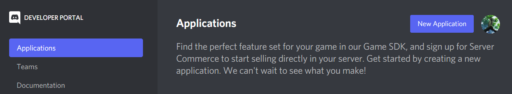
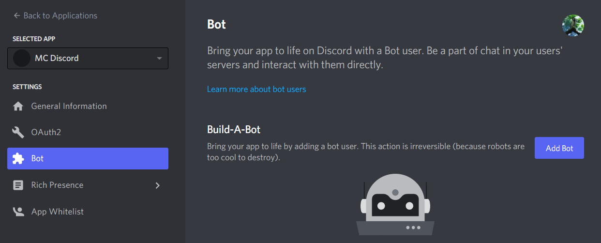
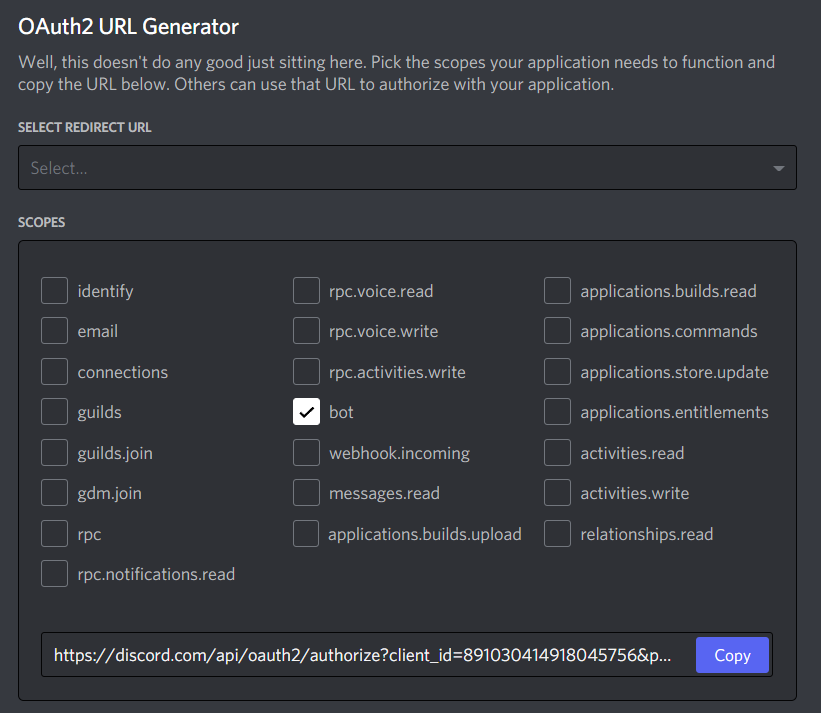
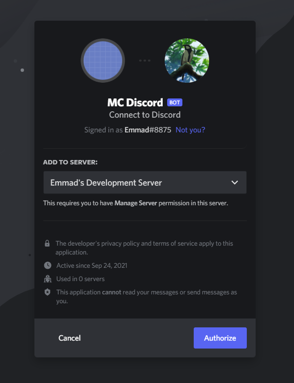
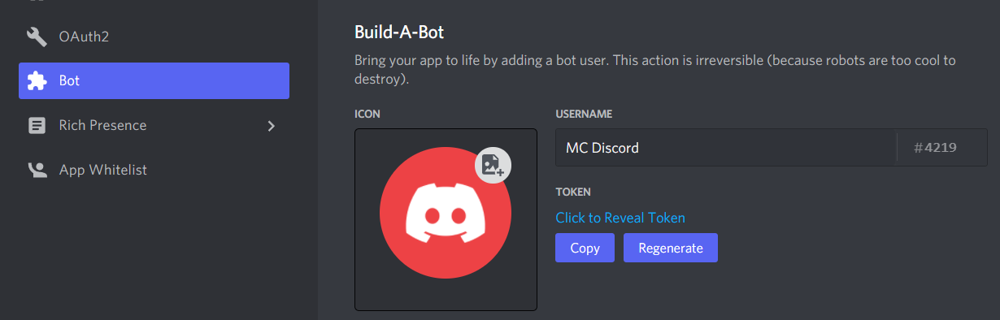
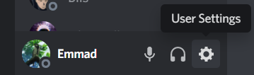
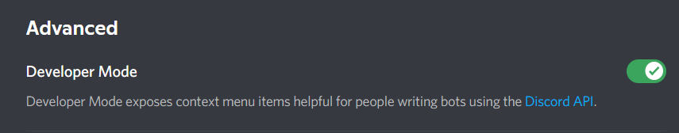
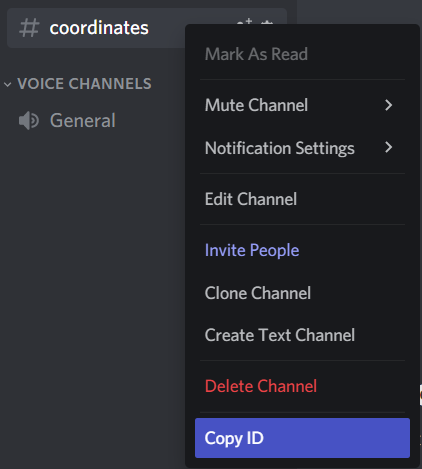

# Setup

## Installing the Plugin

1. Download the plugin JAR file.
2. Place the JAR file inside the "plugins" folder of your server.
3. Run your server.
4. Edit the "config.yml" file inside the "plugins/MCDiscord" folder, supplying "discord-bot-token" and "discord-coordinate-channel-id" with your bot token and the id of the text channel you wish to save coordinates to. Read the steps below if you do not know how to get your bot token and channel id.
5. Restart the server.

## Creating a Bot

1. Open discord's [developer portal](https://discord.com/developers/applications).
2. Click "New Application", and provide a name (you can use "MC Discord").
   

   
Image

   

   

3. Navigate to the "Bot" tab from the sidebar, then click "Add Bot".
   

   
Image

   

   

4. Navigate to the "OAuth2" tab, check the "bot" box in the "Scope" panel, then copy the inviatation link at the bottom of the panel.
   

   
Image

   

   

5. Paste the link into your web broswer, then add the bot to your Discord server (you must have a role with permission to do this).
   

   
Image

   

   

6. Return to the [developer portal](https://discord.com/developers/applications), go to your app, and again navigate to the "Bot" tab, and press "copy" to copy your bot token.
   

   
Image

   

   

7. Paste this bot token into your "config.yml" file (located in your Minecraft server in the "plugins/MCDiscord" folder), replacing the "null" value of the "discord-bot-token" field.

## Getting Your Channel's ID

1. Naviate to your Discord user settings.
   

   
Image

   

   

2. Navigate to "Advanced" under "App Settings" in the sidebar and enable Developer Mode.
   

   
Image

   

   

3. Naviate to your Discord server and find or create the text channel you wish to post coordinates to. It is recommended to use a dedicated channel for this purpose in which users cannot post.
4. Right click on the channel's name and select "Copy ID".
   

   
Image

   

   

5. Paste this id into your "config.yml" file (located in your Minecraft server in the "plugins/MCDiscord" folder), replacing the "null" value of the "discord-coordinate-channel-id" field.
